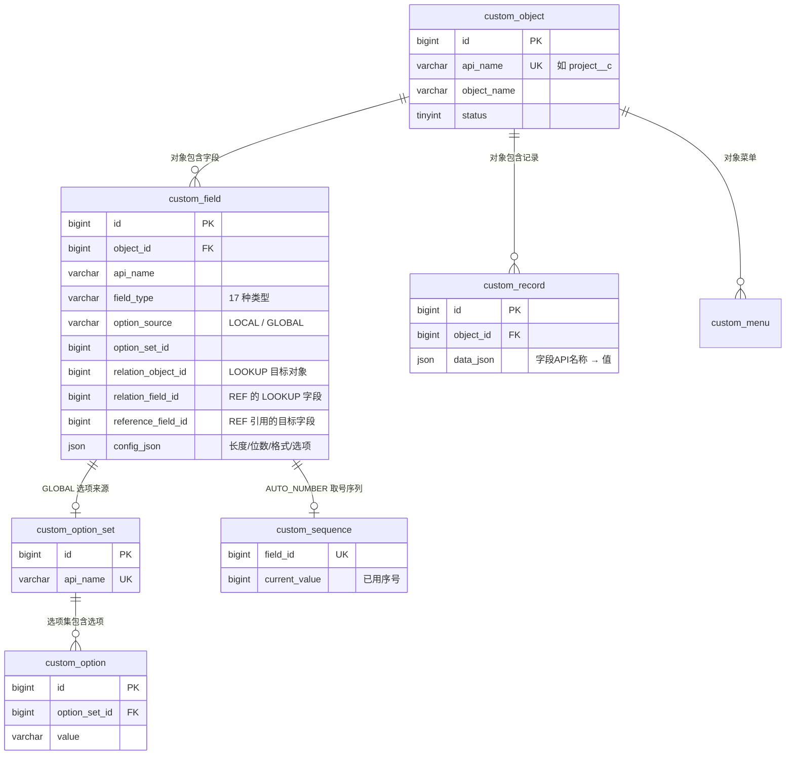

# 元数据驱动架构（Metadata-Driven Architecture）

> 目标读者：参与 Object Engine 开发的工程师。
> 读完你将理解：元数据如何驱动表单、列表与接口的运行时行为，以及**新增一种字段类型需要改动哪些地方**。

---

## 一、核心理念

传统业务开发里，每来一个需求就要建表、写实体、写接口、写页面。Object Engine 把这套循环压缩成一句话：

> **管理员配置元数据，系统生成一切。**

三条基本原则贯穿全部实现：

| 原则 | 含义 | 落地位置 |
| --- | --- | --- |
| **配置即数据** | 对象、字段、选项集、菜单都是普通表里的行，没有硬编码的"业务模型" | `custom_object` / `custom_field` / `custom_option_set` / `custom_menu` |
| **值存 JSON** | 所有记录值进 `custom_record.data_json`，**新增字段或字段类型不需要任何 DDL** | Record CRUD |
| **运行时只认元数据** | 前后端的渲染与校验链路不出现任何业务对象硬编码，一切由 Metadata 决定 | `Metadata API` → 动态组件 |

对比一下两种开发方式：

| 维度 | 传统开发 | Object Engine |
| --- | --- | --- |
| 新增业务对象 | 建表 + 实体 + 接口 + 页面 | 后台点几下，菜单自动注册 |
| 新增字段 | DDL 改表 + 全链路修改 | 配置字段，**零 DDL** |
| 数据展示 | 每个对象写一套列表/表单 | 一套动态组件服务所有对象 |
| 业务字段硬编码 | 遍地都是 | **禁止**（`customer_id` 这类字样不允许出现在通用代码里） |

---

## 二、数据模型



要点：

- **无外键**。所有关联（字段→选项集、LOOKUP→目标对象、引用→目标字段）由应用层校验与保护，删除路径上有完整的引用检查。
- **`data_json` 是值的唯一归宿**：`{ "name": "测试项目", "amount": 111.00, "customer_id": 1001 }`，键就是字段 API 名称。

`custom_field` 的列按职责分四组：

| 列组 | 列 | 说明 |
| --- | --- | --- |
| 身份 | `api_name` / `field_name` / `field_type` | 对象内唯一；类型创建后不可变 |
| 行为开关 | `required_flag` / `unique_flag` / `searchable_flag` / `sortable_flag` | 保存路径按开关执行校验与搜索 |
| 类型配置 | `config_json` | 按类型放不同内容：长度、位数、选项、编号格式 |
| 关联 | `option_source` + `option_set_id` / `relation_object_id` + `relation_field_id` + `reference_field_id` | 选择类字段与关联/引用字段的配置 |

---

## 三、两条链路

### 配置态（管理后台）

```
管理员
  ├─ 新建对象 ──────────────► custom_object + 自动注册菜单
  ├─ 新建字段 ──────────────► custom_field
  │      ├─ 选择类字段 ────► LOCAL 自定义选项 / GLOBAL 引用选项集
  │      ├─ LOOKUP ─────────► 选择关联对象
  │      └─ REFERENCE ──────► 选择本对象 LOOKUP 字段 + 目标字段
  ├─ 维护通用选项集 ────────► custom_option_set / custom_option
  └─ 配置布局与菜单 ────────► custom_object_layout / custom_menu
```

### 运行态（前台动态页）

```
GET /objects/{apiName}/metadata          ←── 唯一的渲染依据
        │  (字段元数据，GLOBAL 字段已注入选项)
        ▼
┌─────────────────────────────────────────┐
│ DynamicForm      动态表单（含校验规则）   │
│ DynamicTable     动态列表（含 displays） │
│ FieldRenderer    字段 → 组件 映射渲染     │
└─────────────────────────────────────────┘
        │  提交 / 查询
        ▼
Record CRUD API（保存时元数据校验，查询时批量计算 displays）
```

前端动态组件从不问"这是哪个对象"，只问"元数据里有什么字段、什么类型、什么配置"。

---

## 四、字段类型系统

当前支持 **17 种**类型，按能力分四层：

| 层 | 类型 |
| --- | --- |
| 基础 | `TEXT` `TEXTAREA` `NUMBER` `MONEY` `PERCENT` `DATE` `DATETIME` `TIME` `BOOLEAN` `PHONE` `EMAIL` `URL` |
| 选择 | `SELECT`（单选） `MULTI_SELECT`（多选）——支持 LOCAL 自定义 / GLOBAL 通用选项集 |
| 关联 | `LOOKUP`（存目标记录 ID） `REFERENCE`（运行时计算，不落库） |
| 系统 | `AUTO_NUMBER`（按格式串自动生成单据编号） |

### 类型系统的两根支柱

**后端：`FieldTypeRegistry` 校验注册表**

```java
REGISTRY.put(FieldType.TEXT, FieldTypeRegistry::requireText);          // 每个类型一个校验器
REGISTRY.put(FieldType.NUMBER, FieldTypeRegistry::requireNumberWithDigits);
REGISTRY.put(FieldType.LOOKUP, FieldTypeRegistry::requireRecordReference);
...
```

- `RecordValidator` 按 `custom_field` 逐字段取校验器执行：存在性 → 必填 → 类型 → 选项/格式/位数/长度
- `validateConfig` 在**创建字段时**校验类型配置本身的合法性（SELECT 必须有选项、格式必须含 `{0}`、位数范围等）

**前端：`constants/field.ts` 三张映射表**

| 映射表 | 作用 |
| --- | --- |
| `FIELD_TYPE_OPTIONS` | 字段类型下拉的候选 |
| `FIELD_TYPE_LABEL_MAP` | 类型 → 中文标签（管理列表展示） |
| `FIELD_COMPONENT_MAP` | 类型 → Element Plus 组件（`FieldRenderer` 渲染依据） |

特例由模板分支处理：`LOOKUP` → `LookupSelect`（远程搜索），`REFERENCE` → `DynamicForm` 只读展示。

---

## 五、关键机制

### 1. 选项来源透明化（GLOBAL 注入）

`CustomFieldServiceImpl.listByObjectId` 加载字段时，把 GLOBAL 字段引用的选项集**启用选项直接注入 `configJson.options`**：

```
custom_field(option_source=GLOBAL, option_set_id=1)
        │ listByObjectId 时注入
        ▼
config_json.options = [{ label: 待处理, value: pending }, ...]
```

此后 `RecordValidator` 的选项校验、`FieldRenderer` 的下拉渲染、`FieldValue` 的 value→label 转换**全部无感复用 LOCAL 的链路**——运行时不需要知道选项来自哪里。选项集停用或清空则不注入，字段呈现为"未配置选项"。

### 2. LOOKUP / REFERENCE：ID 存储 + displays 批量计算

- **LOOKUP**：`data_json` 只存目标记录 ID（裸数字）。表单用 `LookupSelect` 远程搜索；列表的展示文本由后端批量解析
- **REFERENCE**：**不占存储**。保存请求中的写入企图直接剥离；查询时按 `LOOKUP 字段 → 目标记录 → 引用字段` 一跳解析，结果放进 `RecordVO.displays`（字段 API 名称 → 展示值）

**防 N+1**：`enrichRelationFields` 先收集本页全部 LOOKUP ID、按目标对象分组，**每个目标对象只做一次 `id IN (...)` 批量查询**，再内存映射填充。查询次数 = 涉及的目标对象数，与记录条数无关。

展示文本启发式（前后端一致）：目标记录的 `name` 字段 → 第一个启用中的 TEXT 字段 → 第一个 TEXTAREA → 兜底 `#记录ID`。

### 3. 关键字搜索与唯一性

- 关键字搜索走 `JSON_EXTRACT(data_json, '$.字段')` 模糊匹配，**字段名走参数绑定防注入**；候选字段优先取 `searchable_flag=1` 的文本类字段，未配置则回退全部文本类字段
- 唯一性（`unique_flag`）为应用层查重：同对象同字段同值即拒绝。JSON 列无法建数据库唯一索引，极端并发存在竞态窗口（Demo 取舍，代码有注释）

### 4. 自动编号（AUTO_NUMBER）

```
创建记录（事务内）
  → 原子取号：UPDATE custom_sequence SET current_value = current_value + 1（行级锁）
  → 按格式串生成：PO#({YYYY})({MM})({DD})-{0} → PO#(2026)(08)(30)-0001
  → 写入 data_json
```

序列行在字段创建后惰性初始化（当前值 = 起始编号 - 1），并发初始化由 `field_id` 唯一键兜底。编辑记录不重新取号。

### 5. 生命周期保护

| 操作 | 保护规则 |
| --- | --- |
| 删除 LOOKUP 字段 | 被 REFERENCE 引用时拒绝 |
| 删除被引用的目标字段 | 拒绝 |
| LOOKUP 调整关联对象 | 有 REFERENCE 依赖时拒绝 |
| 删除选项集 | 被字段引用时拒绝 |
| 修改选项 value | 不允许（Record 数据依赖 value） |
| 删除对象 | 被 LOOKUP/REFERENCE 字段引用时拒绝；对象删除级联清理字段、记录、菜单 |
| 对象停用 | 其 GLOBAL 菜单自动从导航消失，重新启用自动恢复 |

---

## 六、Record 查询管线（以列表为例）

```
GET /objects/project__c/records?page=1&keyword=111
  1. requireByApiName            确认对象存在
  2. applyKeywordFilter          按可搜索字段拼 JSON 路径 LIKE（参数绑定）
  3. 分页查询 custom_record
  4. stripComputedFields         （写入路径）剥离 REFERENCE 写入企图
  5. RecordValidator             逐字段校验（写入路径）
  6. generateAutoNumbers         （写入路径）原子取号并按格式生成
  7. checkUniqueValues           （写入路径）uniqueFlag 应用层查重
  8. enrichRelationFields        （读取路径）批量计算 LOOKUP/REFERENCE displays
  9. PageResult{ records, total, page, pageSize }
```

---

## 七、实操指南：如何新增一种字段类型

以"日期时间 DATETIME"为参照，改动全部集中在类型扩展点，**零 DDL**：

**后端**

1. `enums/FieldType` 增加枚举值
2. `engine/FieldTypeRegistry` 注册值校验器（每类型一个静态方法）；类型有配置项时在 `validateConfig` 增加配置合法性检查
3. 需要参与关键字搜索的文本类类型，加入 `CustomRecordServiceImpl.TEXT_SEARCH_TYPES`

**前端**

4. `types/field.ts` 的 `FieldType` 联合类型增加字面量
5. `constants/field.ts` 三张映射表各加一行；非 Element 标准组件的类型在 `FieldRenderer` 模板加特殊分支
6. `FieldValue` 增加展示格式化；`DynamicForm` 决定必填提示用「请选择」还是「请输入」
7. `utils/record.ts` 的 `buildFormModel` 处理默认值/存储值 → 控件类型的桥接

**收尾**

8. `FieldFormDialog` 如有类型专属配置（如编号格式、位数），在提交逻辑与模板中接入 `configJson`

---

## 八、当前边界与限制

| 限制 | 说明 |
| --- | --- |
| 唯一性为应用层查重 | JSON 列无法建数据库唯一索引，极端并发存在竞态窗口 |
| REFERENCE 仅一跳 | 不支持 REFERENCE → REFERENCE 链式引用 |
| 关联展示文本是实时解析 | LOOKUP 列表文本实时解析；目标记录改名后重新加载即生效，无历史快照问题 |
| 多值关联 / 主子明细未实现 | 需要对象间多对多与主从模型，属架构级扩展 |
| 无鉴权 | API 裸奔，对外暴露需外层网关认证 |
| 无缓存层 | 选项集/元数据每次实时查询；API 已收敛，后续可统一加缓存 |

---

<div align="center">

**Metadata 是唯一的真相来源，其余皆是它的投影。**

</div>
